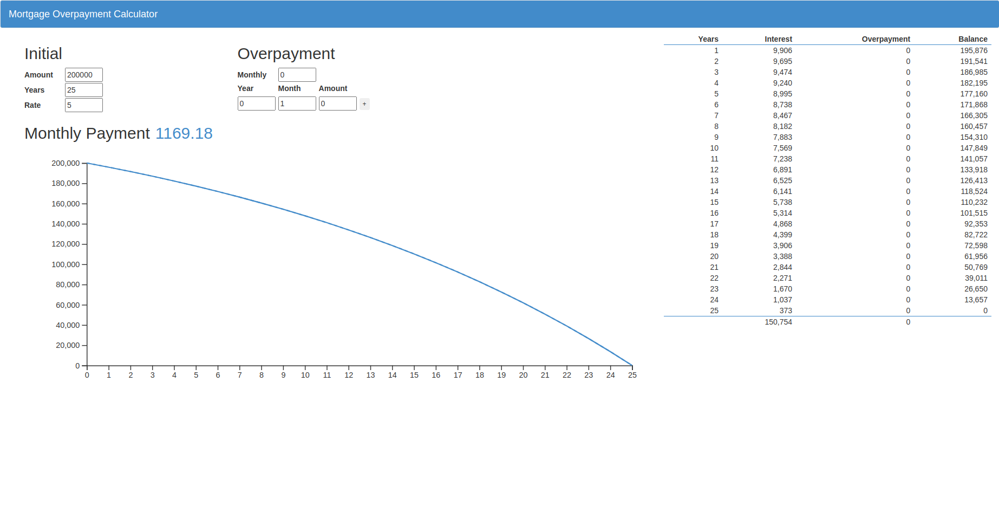

## Application

Mortgage overpayment calculator using React and D3.


## Get Started

To start working on the project, first clone the repository and install the dependencies.

```bash
npm install
```

Then run the development server:

```bash
npm run start
```

Now you can open [http://localhost:3000](http://localhost:3000) with your browser to see the application.
